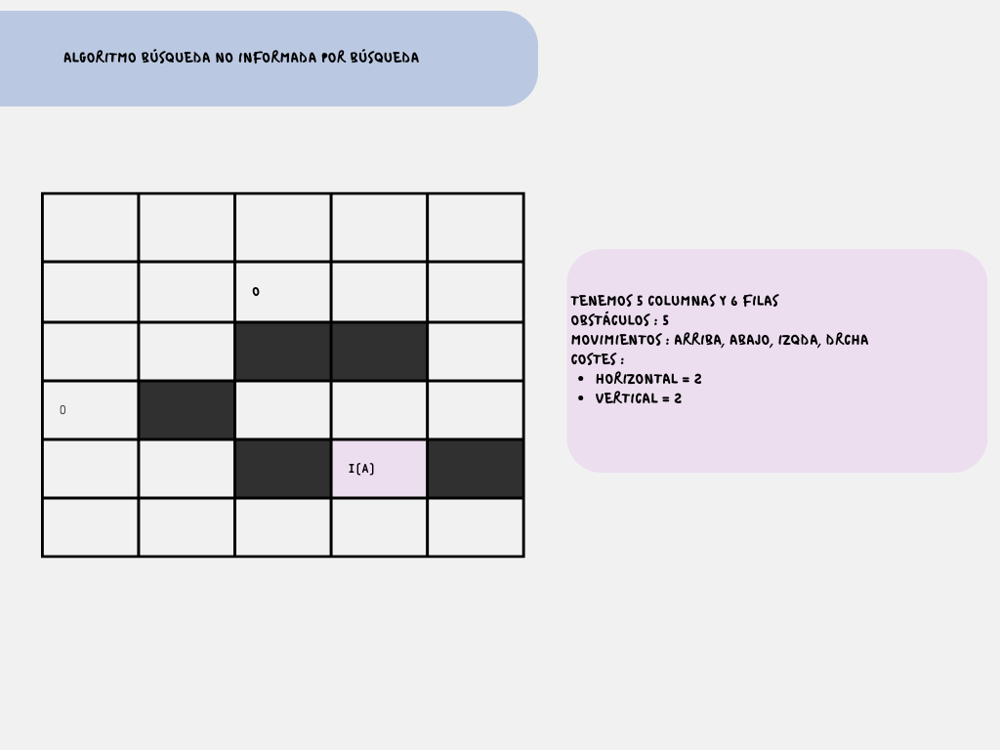
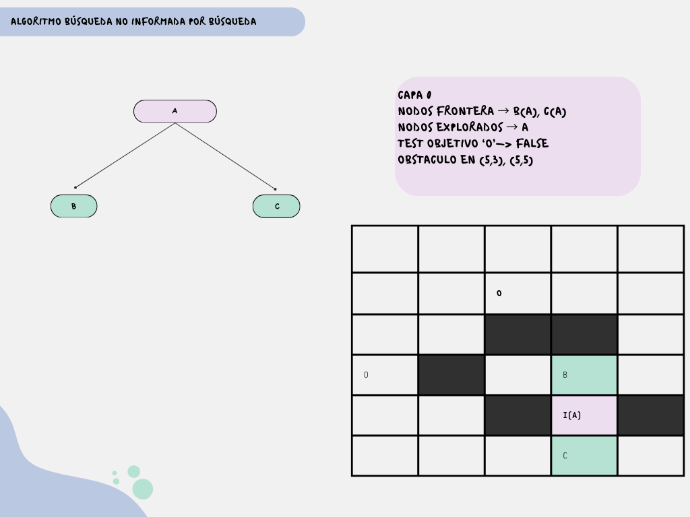
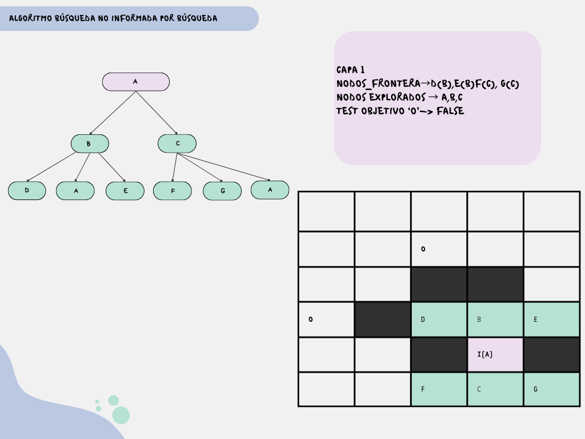
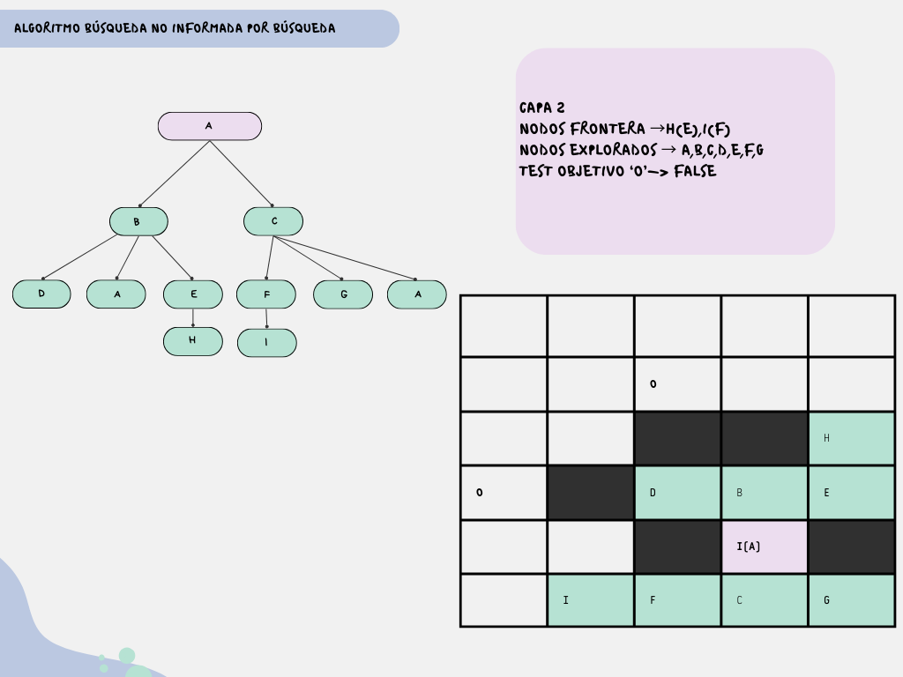
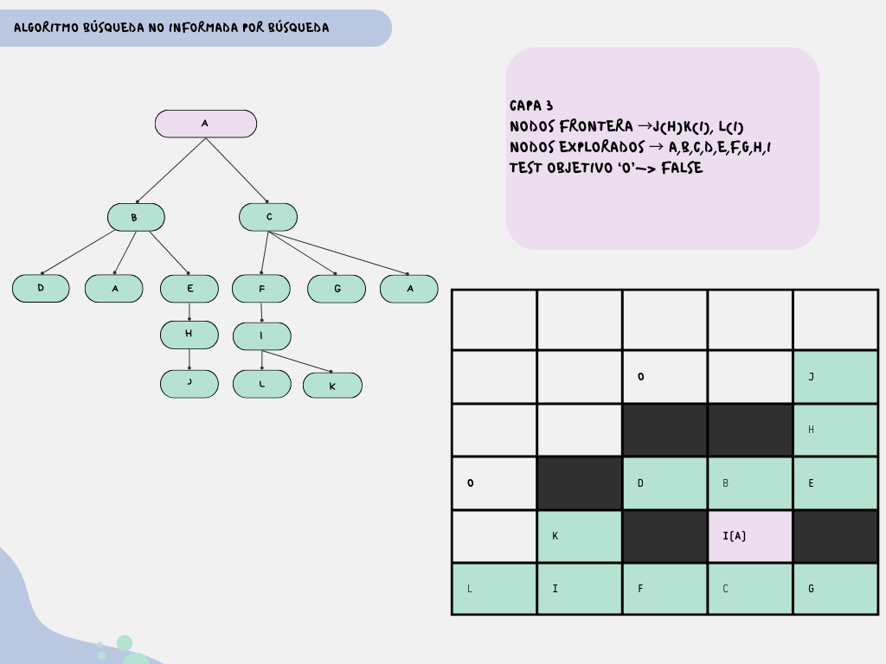
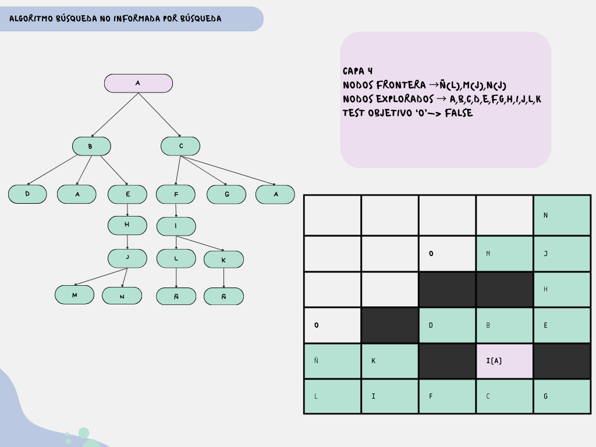
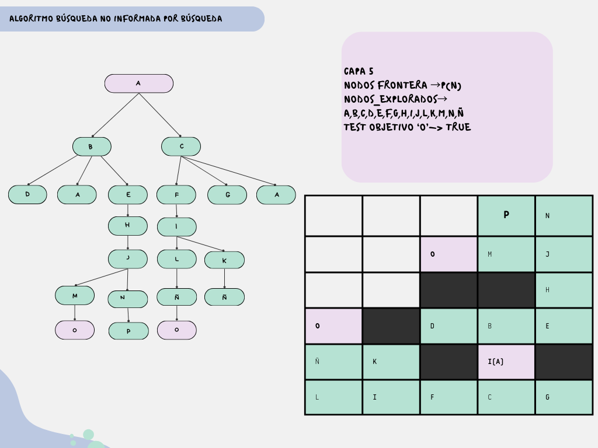

# 🗺️ Ejercicio 1: Búsqueda de Rutas (NPC)

## 1. Definición del Problema

Queremos llevar a un NPC desde un punto de inicio hasta una meta en un tablero con muros, minimizando costes o pasos según el algoritmo.

* **Mapa:** Cuadrícula de $6 \times 5$.
* **Estado Inicial ($S_0$):** Casilla `(5, 4)`.
* **Metas posibles:** `(2, 3)` y `(4, 1)`.
* **Movimientos:** `{Arriba, Abajo, Izquierda, Derecha}`.
* **Costes:**
  * ↕️ Vertical: **1**
  * ↔️ Horizontal: **2**

---

## 2. Algoritmos Aplicados

###      2.1. Búsqueda en Anchura (BFS)

El algoritmo explora el mapa por "capas" o niveles de profundidad. Utiliza una **Cola (FIFO)** para gestionar la frontera.

**Datos de ejecución:**
* **Estrategia:** Expandir nodos superficiales primero.
* **Orden de operadores:** Arriba, Abajo, Izquierda, Derecha.
* **Ignora costes:** Busca el camino con menor número de pasos.

>
> 
> 
> 
> 
> 
> 
> 

#### 🏆 Solución Final (BFS)

* **Camino encontrado:** `(5,4) → (4,4) → (4,5) → (3,5) → (2,5) → (2,4) → (2,3)`
* **Profundidad:** 6 pasos.
* **Coste Acumulado ($g$):** 9 (Calculado como: $1+2+1+1+2+2$).

---

### 2.2. Búsqueda en Profundidad (DFS)

- Gestión de la frontera: Se utiliza una PILA (LIFO - Last In, First Out).
  El último nodo generado es el primero en ser extraído.
- Orden de operadores: Arriba, Abajo, Izquierda, Derecha.
- Nota sobre el orden:
  Para respetar el orden de exploración usando una pila, los nodos hijos se
  insertan en orden inverso (Derecha, Izquierda, Abajo, Arriba).
- Control de ciclos:
  No se permiten nodos repetidos en el camino actual.

## Definición del Problema

- Estado inicial (i): Nodo A (5,4).
- Estado objetivo (e): Nodo M (2,3).
- Función de coste (g):
  - Movimiento vertical: coste 1.
  - Movimiento horizontal: coste 2.
  El algoritmo DFS no utiliza el coste para decidir el camino, únicamente se calcula al final para evaluar la solución.

> 

## Análisis :

### Límite de profundidad = 5

El algoritmo explora primero la rama prioritaria:

A → B → E → H → J

El nodo J se encuentra a profundidad 4. Desde este nodo se generan los
sucesores K (1,5) y L (2,4), ambos a profundidad 5.

Se extrae primero el nodo K. Al intentar expandirlo, sus posibles hijos quedarían
a profundidad 6, superando el límite establecido, por lo que no se generan
sucesores.

Posteriormente se extrae el nodo L. Ocurre la misma situación, el límite de
profundidad impide generar a su hijo M (2,3), que corresponde al estado objetivo.

El algoritmo no falla porque no exista solución, sino porque la solución se
encuentra a una profundidad mayor (d = 6) que el límite permitido (l = 5).

### Límite de profundidad = 6

Al aumentar el límite de profundidad a 6, cuando el algoritmo procesa el nodo
L (2,4), que se encuentra a profundidad 5, se permite la generación de sucesores.

En este caso se genera el nodo M (2,3) a profundidad 6.

El test objetivo reconoce el nodo M como solución y el algoritmo finaliza.
