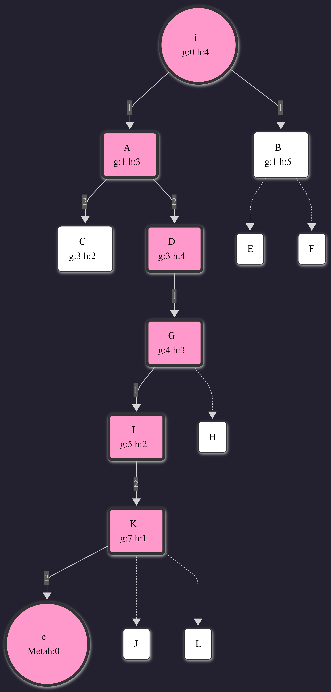

# Búsqueda Heurística (A*)

## Definición del Problema y Métricas

Se han establecido los siguientes parámetros de coste y evaluación:

### Reglas de Movimiento y Costes
* **Coste Vertical (Arriba/Abajo):** 1 unidad.
* **Coste Horizontal (Izq/Der):** 2 unidades.
* **Prioridad de Expansión:**
    1.  Menor valor de evaluación **f(n)**.
    2.  En caso de empate, criterio FIFO (First In, First Out).

### Notación:
Cada nodo en la frontera se representa mediante el formato:
**N: [g | f | h]**

Donde:
* **N**: Identificador del nodo (letra).
* **g**: Coste real acumulado desde el inicio.
* **f**: Función de evaluación (f = g + h).
* **h**: Heurística (distancia estimada al objetivo).

---

## Evolución Algoritmo

A continuación, se detalla la evolución de la Frontera (Abierta) y la lista de Cerrados. Los nodos en **negrita** son los seleccionados para expandir en esa iteración.

| Iteración | Nodo Test (f) | Estado de la Frontera (F)   *Ordenada por menor f* | Lista de Cerrados (C)   *Nodos ya expandidos* |
| :---: | :--- | :--- | :--- |
| **1** | **i** (f=4) | { **i** [0\|4\|4] } | { i } |
| **2** | **A** (f=4) | { **A** [1\|4\|3], B [1\|6\|5] } | { i, A } |
| **3** | **C** (f=5) | { **C** [3\|5\|2], B [1\|6\|5], D [3\|7\|4] } | { i, A, C } |
| **4** | **B** (f=6) | { **B** [1\|6\|5], D [3\|7\|4] } | { i, A, C, B } |
| **5** | **D** (f=7) | { **D** [3\|7\|4], E [3\|7\|4], F [3\|9\|6] } | { i, A, C, B, D } |
| **6** | **E** (f=7) | { **E** [3\|7\|4], G [4\|7\|3], F [3\|9\|6] } | { i, A, C, B, D, E } |
| **7** | **G** (f=7) | { **G** [4\|7\|3], F [3\|9\|6], H [5\|10\|5] } | { i, A, C, B, D, E, G } |
| **8** | **I** (f=7) | { **I** [5\|7\|2], F [3\|9\|6], H [5\|10\|5] } | { i, A, C, B, D, E, G, I } |
| **9** | **K** (f=8) | { **K** [7\|8\|1], F [3\|9\|6], J [6\|9\|3], H [5\|10\|5] } | { i, A, C, B, D, E, G, I, K } |
| **10** | **F** (f=9) | { **F** [3\|9\|6], J [6\|9\|3], e [9\|9\|0], L [8\|10\|2], H [5\|10\|5] } | { i, ..., K, F } |
| **11** | **J** (f=9) | { **J** [6\|9\|3], e [9\|9\|0], L [8\|10\|2], H [5\|10\|5] } | { i, ..., F, J } |
| **12** | **e** (f=9) | { **e** [9\|9\|0], L [8\|10\|2], H [5\|10\|5] } | { i, ..., J, e } |

---

## Resultados

Tras evaluar el nodo objetivo **e**, el algoritmo finaliza con los siguientes datos:

### Estado Final
* **Conjunto de Cerrados (Total explorados):** 12 nodos.
    * C = { i, A, C, B, D, E, G, I, K, F, J, e }
* **Nodos remanentes en Frontera:**
    * F = { H, L }

### Camino Óptimo
Reconstruyendo la ruta desde el objetivo hacia el inicio a través de  nodos padre:

**Inicio (i) → A → D → G → I → K → Objetivo (e)**

**Coste Total :** 9

---

> *¿Es admisible la heurística utilizada en este algoritmo?*

**Sí, es admisible.**  
Para que una heurística sea admisible, debe cumplir la condición h(n) <= h*(n), donde h*(n) es el coste real mínimo para llegar al objetivo. En este caso, la heurística utilizada (distancia en casillas) nunca sobreestima el coste real, ya que el coste mínimo de movimiento es 1. Por tanto, la estimación es siempre menor o igual al coste real, lo que garantiza la optimalidad.

**P2: Clasificación del Algoritmo**  
> *¿Podemos afirmar que se trata del algoritmo A*?*

**Sí, efectivamente es A*.**  
El algoritmo usa la función de evaluación f(n) = g(n) + h(n) combinando el coste real y la estimación. Dado que hemos demostrado en el punto anterior que la heurística h(n) es admisible, el algoritmo actúa como un A* estándar y garantiza encontrar el camino de coste mínimo si hay una solución.