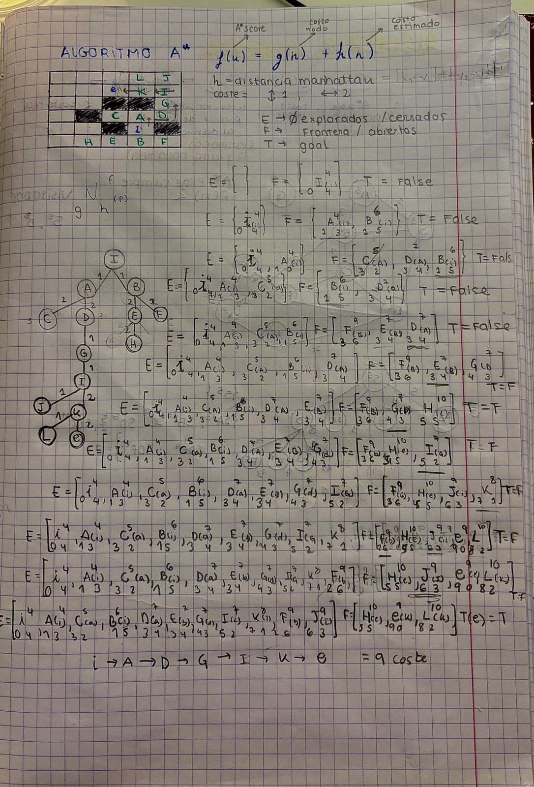

# Búsqueda Heurística (A*)

## Definición del Problema y Métricas

Se han establecido los siguientes parámetros de coste y evaluación:

### Reglas de Movimiento y Costes
* **Coste Vertical (Arriba/Abajo):** 1 unidad.
* **Coste Horizontal (Izq/Der):** 2 unidades.
* **Prioridad de Expansión:**
    1.  Menor valor de evaluación **f(n)**.
    2.  En caso de empate, criterio FIFO (First In, First Out).

### Evolución algoritmo

---

> *¿Es admisible la heurística utilizada en este algoritmo?*

**Sí, es admisible.**  
Para que una heurística sea admisible, debe cumplir la condición h(n) <= h*(n), donde h*(n) es el coste real mínimo para llegar al objetivo. En este caso, la heurística utilizada (distancia en casillas) nunca sobreestima el coste real, ya que el coste mínimo de movimiento es 1. Por tanto, la estimación es siempre menor o igual al coste real, lo que garantiza la optimalidad.

**P2: Clasificación del Algoritmo**  
> *¿Podemos afirmar que se trata del algoritmo A*?*

**Sí, efectivamente es A*.**  
El algoritmo usa la función de evaluación f(n) = g(n) + h(n) combinando el coste real y la estimación. Dado que hemos demostrado en el punto anterior que la heurística h(n) es admisible, el algoritmo actúa como un A* estándar y garantiza encontrar el camino de coste mínimo si hay una solución.