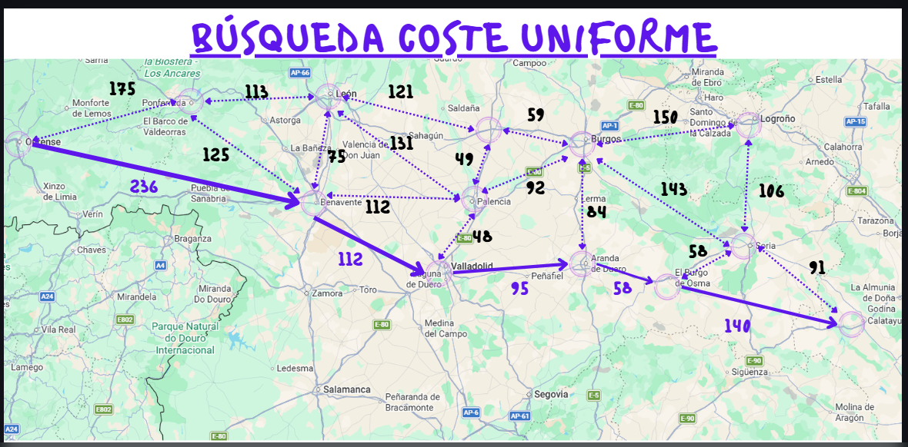

# 🗺️ Búsqueda de Coste Uniforme (UCS)

>  **Búsqueda de Coste Uniforme** (Uniform Cost Search) 
En el hipotético caso de que el servicio Google Maps empleara el algoritmo de búsqueda por coste uniforme para encontrar la ruta más corta (en km) entre dos localidades, calcula la solución que ofrecería para la ruta Ourense-Calatayud dadas las siguientes distancias kilométricas:
### 🗺️ Datos del Mapa: Distancias y Costes

A continuación se detallan las aristas del grafo y sus pesos (distancia en km) utilizados para la prueba del algoritmo:

| 🛣️ Trayecto (Origen - Destino) | 📏 Distancia (Coste) |
| :--- | :---: |
| Ourense ↔️ Ponferrada | 175 km |
| Ourense ↔️ Benavente | 236 km |
| Ponferrada ↔️ León | 113 km |
| Ponferrada ↔️ Benavente | 125 km |
| Benavente ↔️ León | 75 km |
| Benavente ↔️ Valladolid | 112 km |
| Benavente ↔️ Palencia | 112 km |
| Palencia ↔️ León | 131 km |
| Palencia ↔️ Valladolid | 48 km |
| Palencia ↔️ Osorno | 49 km |
| Palencia ↔️ Burgos | 92 km |
| León ↔️ Osorno | 121 km |
| Osorno ↔️ Burgos | 59 km |
| Valladolid ↔️ Aranda | 95 km |
| Burgos ↔️ Aranda | 84 km |
| Aranda ↔️ Osma | 58 km |
| Osma ↔️ Calatayud | 140 km |
| Osma ↔️ Soria | 58 km |
| Burgos ↔️ Soria | 143 km |
| Burgos ↔️ Logroño | 150 km |
| Logroño ↔️ Soria | 106 km |
| Soria ↔️ Calatayud | 91 km |
---
> 

ITERACIÓN 1
F = { Ou 0 }
Test( Ou 0 )
C = { Ou 0 }

ITERACIÓN 2
F = { Po (Ou) 175, Be (Ou) 236 }
Test( Po (Ou) 175 )
C = { Ou 0, Po (Ou) 175 }

ITERACIÓN 3
F = { Be (Ou) 236, Le (Po) 288, Be (Po) 300 }
Test( Be (Ou) 236 )
C = { Ou 0, Po (Ou) 175, Be (Ou) 236 }

ITERACIÓN 4
F = { Le (Po) 288, Le (Be) 311, Pa (Be) 348, Va (Be) 348 }
Test( Le (Po) 288 )
C = { Ou 0, Po (Ou) 175, Be (Ou) 236, Le (Po) 288 }

ITERACIÓN 5
F = { Pa (Be) 348, Va (Be) 348, Oso (Le) 409, Pa (Le) 419 }
Test( Pa (Be) 348 )
C = { Ou 0, Po (Ou) 175, Be (Ou) 236, Le (Po) 288, Pa (Be) 348 }

ITERACIÓN 6
F = { Va (Be) 348, Oso (Le) 409, Bu (Pa) 441 }
Test( Va (Be) 348 )
C = { Ou 0, Po (Ou) 175, Be (Ou) 236, Le (Po) 288, Pa (Be) 348, Va (Be) 348 }

ITERACIÓN 7
F = { Oso (Le) 409, Bu (Pa) 441, Ar (Va) 443 }
Test( Oso (Le) 409 )
C = { Ou 0, Po (Ou) 175, Be (Ou) 236, Le (Po) 288, Pa (Be) 348, Va (Be) 348, Oso (Le) 409 }

ITERACIÓN 8
F = { Bu (Pa) 441, Ar (Va) 443, Bu (Oso) 468 }
Test( Bu (Pa) 441 )
C = { Ou 0, Po (Ou) 175, Be (Ou) 236, Le (Po) 288, Pa (Be) 348, Va (Be) 348, Oso (Le) 409, Bu (Pa) 441 }

ITERACIÓN 9
F = { Ar (Va) 443, Lo (Bu) 591, So (Bu) 584 }
Test( Ar (Va) 443 )
C = { Ou 0, Po (Ou) 175, Be (Ou) 236, Le (Po) 288, Pa (Be) 348, Va (Be) 348, Oso (Le) 409, Bu (Pa) 441, Ar (Va) 443 }

ITERACIÓN 10
F = { Lo (Bu) 591, So (Bu) 584, Os (Ar) 501 }
Test( Os (Ar) 501 )
C = { Ou 0, Po (Ou) 175, Be (Ou) 236, Le (Po) 288, Pa (Be) 348, Va (Be) 348, Oso (Le) 409, Bu (Pa) 441, Ar (Va) 443, Os (Ar) 501 }

ITERACIÓN 11
F = { Lo (Bu) 591, So (Bu) 584, So (Os) 559, Ca (Os) 641 }
Test( So (Bu) 584 )
C = { Ou 0, Po (Ou) 175, Be (Ou) 236, Le (Po) 288, Pa (Be) 348, Va (Be) 348, Oso (Le) 409, Bu (Pa) 441, Ar (Va) 443, Os (Ar) 501, So (Bu) 584 }

ITERACIÓN 12
F = { Lo (Bu) 591, Ca (Os) 641, Ca (So) 650 }
Test( Lo (Bu) 591 )
C = { Ou 0, Po (Ou) 175, Be (Ou) 236, Le (Po) 288, Pa (Be) 348, Va (Be) 348, Oso (Le) 409, Bu (Pa) 441, Ar (Va) 443, Os (Ar) 501, So (Bu) 584, Lo (Bu) 591 }

ITERACIÓN 13
F = { Ca (Os) 641, Ca (Os) 641 }
Test( Ca (Os) 641 )
C = { Ou 0, Po (Ou) 175, Be (Ou) 236, Le (Po) 288, Pa (Be) 348, Va (Be) 348, Oso (Le) 409, Bu (Pa) 441, Ar (Va) 443, Os (Ar) 501, So (Bu) 584, Lo (Bu) 591, Ca (Os) 641 }

Camino: 

    Ou 0, 
    Be (Ou) 236,
    Va (Be) 348, 
    Ar (Va) 443, 
    Os (Ar) 501, 
    Ca (Os) 641

Camino: Ou → Be → Va → Ar → Os → Ca

Coste total: 641
